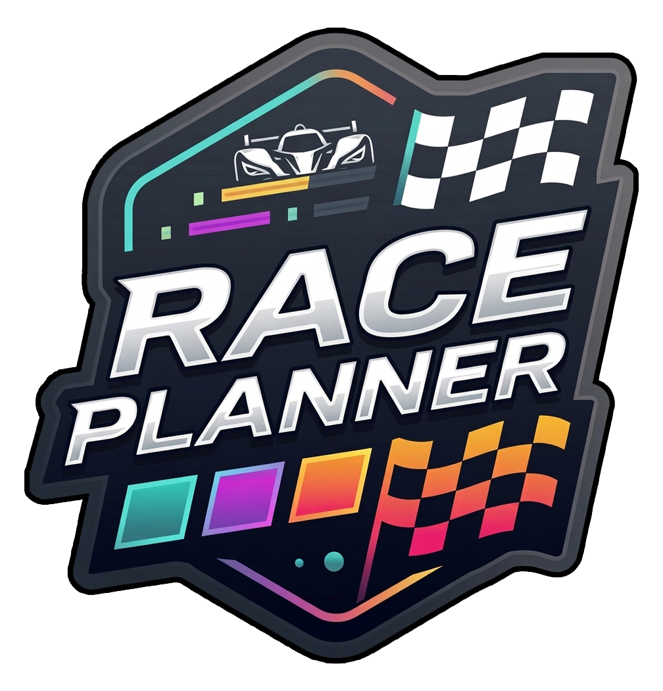

  

<h1 align="center">Race Planner</h1>

  <b>Planification de courses d'endurance pour iRacing & Le Mans Ultimate</b> 
  <i>Endurance race planning for iRacing & Le Mans Ultimate</i>

---

## FR — Qu'est-ce que c'est ?

Race Planner est un logiciel de bureau conçu pour les passionnés de courses d'endurance en simulation automobile (iRacing, Le Mans Ultimate, etc.).

Son objectif : vous aider à planifier, organiser et suivre vos courses d'endurance en équipe, du briefing d'avant-course jusqu'à la ligne d'arrivée.

### Concrètement, Race Planner permettra de :

- Configurer une course (circuit, durée, voiture, carburant, heures de jour/nuit)
- Gérer votre équipage de pilotes
- Planifier les relais sur une frise chronologique visuelle
- Équilibrer automatiquement le temps de volant entre les pilotes
- Définir les stratégies pneus et carburant pour chaque relais
- Se connecter en direct à iRacing pour suivre la course en temps réel
- Voir les positions, chronos et écarts de tous les pilotes en piste
- Afficher les classes de voitures (GT3, GTP, LMP2...) avec des badges couleur
- Recevoir des alertes visuelles lors des drapeaux (jaune, rouge, bleu...)
- Basculer automatiquement en mode nuit quand la course passe dans l'obscurité
- Tester toutes ces fonctionnalités via un mode démo intégré, sans avoir besoin de lancer le simulateur

### AVERTISSEMENT — Version très approximative

Race Planner est actuellement en phase de développement très précoce. Ce que vous avez entre les mains est une version de travail, encore brute et incomplète. De nombreuses fonctionnalités sont absentes ou partiellement implémentées, l'interface va évoluer, et des bugs sont à prévoir.

Cela dit, le projet avance vite et de nouvelles fonctionnalités arrivent régulièrement. L'ambition est d'en faire un véritable outil de stratégie d'endurance, fiable et complet, pensé par et pour les simracers.

Merci de votre patience et de vos retours — ils comptent énormément pour la suite du développement.

---

## EN — What is it?

Race Planner is a desktop application designed for endurance racing enthusiasts in sim racing (iRacing, Le Mans Ultimate, etc.).

Its goal: help you plan, organize, and monitor your team endurance races, from pre-race briefing to the checkered flag.

### What Race Planner will offer:

- Configure a race (track, duration, car, fuel, day/night hours)
- Manage your driver crew
- Plan stints on a visual timeline
- Automatically balance driving time between drivers
- Set tire and fuel strategies for each stint
- Connect live to iRacing for real-time race tracking
- View positions, lap times, and gaps for all drivers on track
- Display car classes (GT3, GTP, LMP2...) with colored badges
- Receive visual alerts for flags (yellow, red, blue...)
- Automatically switch to night mode when the race enters darkness
- Test all features via a built-in demo mode, no simulator needed

### WARNING — Very early version

Race Planner is currently in a very early development phase. What you have is a rough, incomplete work-in-progress build. Many features are missing or partially implemented, the UI will evolve, and bugs are expected.

That said, the project is moving fast and new features are being added regularly. The goal is to build a reliable, complete endurance strategy tool, made by and for sim racers.

Thank you for your patience and feedback — it means a lot for the future of this project.

---

## Tech Stack

- **Electron** — Desktop app (Windows)
- **React 19 + TypeScript** — UI
- **Vite 6** — Build
- **Turborepo** — Monorepo
- **irsdk-node** — iRacing telemetry
- **Zustand** — State management
- **WebSocket** — Client/server communication

## License

All rights reserved.
